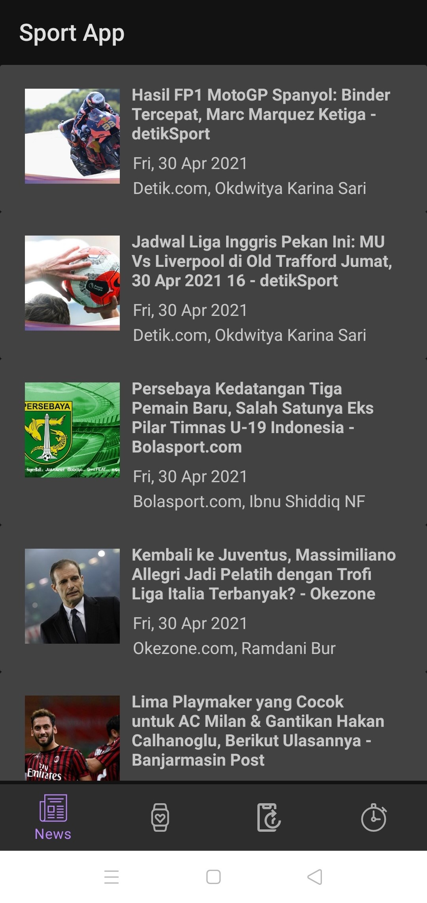
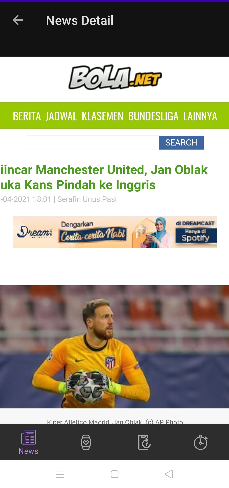
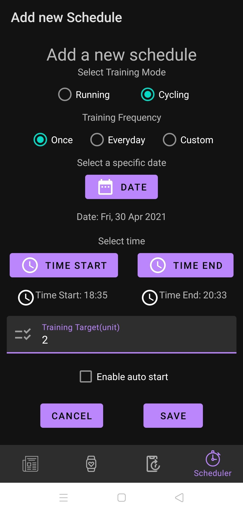
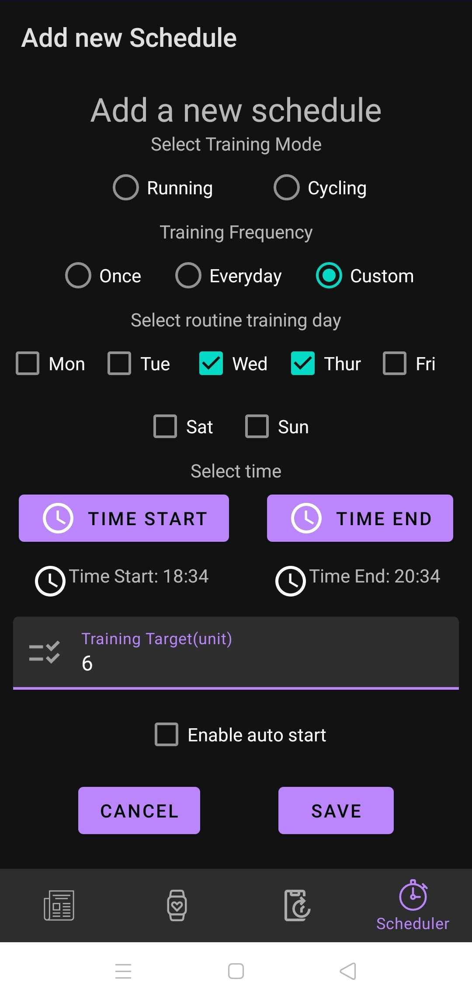
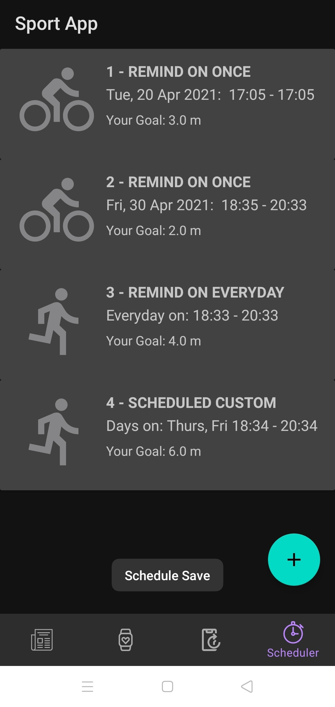
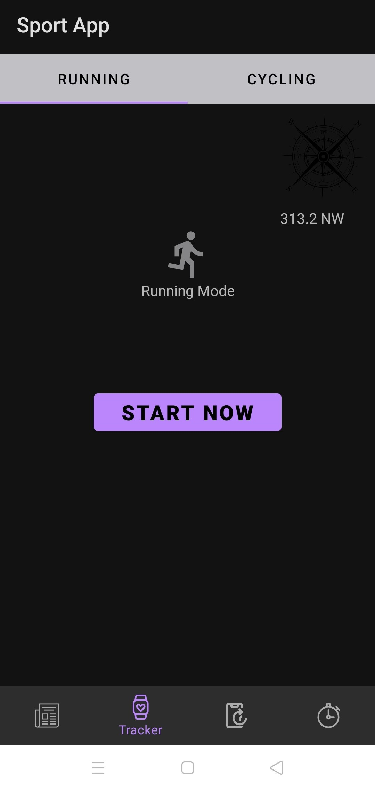
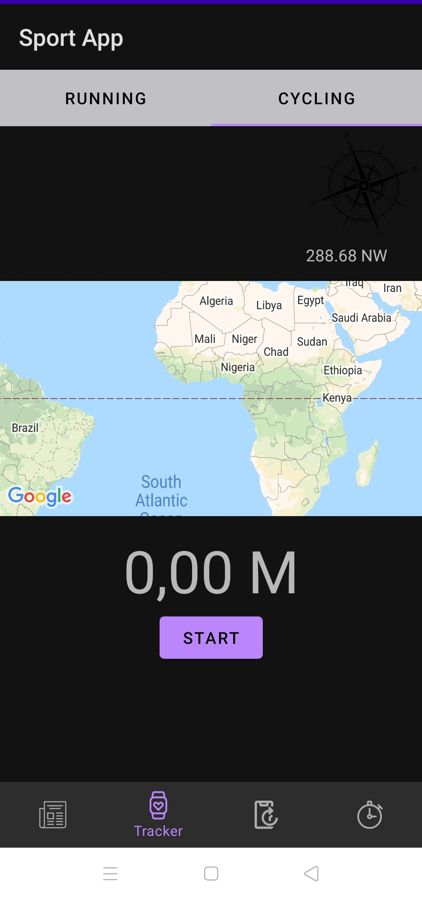
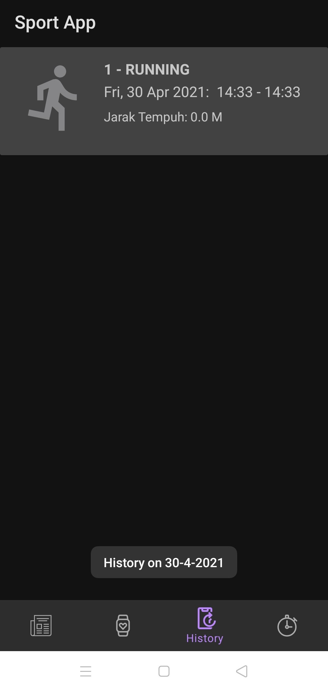
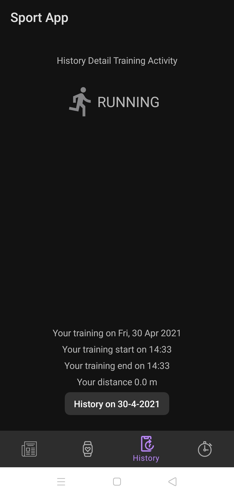

# Tugas Besar Android - Sports App (IF3210)

## Deskripsi

Sports app adalah aplikasi berbasis android untuk menunjang aktivitas olahraga jogging/cycling dengan beberapa fitur berikut:

- Sport News: Akses berita dengan tampilan web pada aplikasi
- Training Tracker: User dapat melakukan jogging / cycling dan aplikasi dapat merekam rute olahraga yang dilakukan dan menghitung jarak tempuhnya
- Training Scheduler: User dapat menjadwalkan aktivitas jogging / cycling dengan opsi otomatis melakukan tracking atau tidak, dan opsi pilihan penjadwalan yang bervariasi (setiap hari, suatu waktu, pada hari tertentu)
- Training History: User dapat melihat track record hasil aktivitas olahraganya

Aplikasi memerlukan minimal Android SDK 19 (Kitkat 4.4 keatas), dan dibuat dengan bahasa pemprograman kotlin.

## Langkah Menjalankan Aplikasi

1.  Clone repository pada android studio
2.  Pilih device untuk dijalankan (Melalui AVD manager lalu jalankan emulator) atau menghubungkan device android dengan USB debugging (Rekomendasi minSDK 21, dan target SDk 30)
3.  Untuk menjalankan klik tombol run sebelah opsi device yang dipilih

## Library Yang di Pakai

- Material.IO untuk material komponen
- Glide untuk image loader
- Async HTTP untuk remote database
- Dagger untuk dependency Injection
- Room untuk local database sqlite
- Navigation ui ktx, navigation fragment untuk menggunakan nav-graph
- Google play service location untuk menggunakan GPS
- Easy Permission untuk menggeluarkan pop up notifikasi izin aplikasi
- Flexbox untuk menggunakan layout flexbox

Detail versi library dapat ditemukan di file build.gradle

## Pembagian Kerja

- 13518072 / Muchammad Ibnu Sidqi
  - {{ tambahkan }}
- 13518102 / Mohamad Falah Sutawindaya
  - Fix (menambahkan field (+lebih deskriptif) di view model) untuk news, history, schedule (list, add)
  - Menambah constraint layout fleksibel untuk news, history, schedule (list, add)
  - Theming (spacing, icon, etc)
  - Data set notifier pada beberapa text view
- 13518150 / Stephen Thajeb
  - Membuat bottom navigation dan juga interface IBottomNavigation untuk menghandle navigasi antar halaman
  - Membuat halaman sport news (halaman utama dan halaman detail dengan menggunakan WebView) dan responsiveness halaman tersebut
  - Membuat fitur fetch data dari api news
  - Membuat halaman Training Tracker dengan Tablayout
  - Membuat fitur deteksi langkah dan kompas
  - Membuat TrainingService dan Receiver Tracker yang dapat menjadwalkan, menjalankan, dan menyimpan data training secara otomatis
  - Membuat halamaman Scheduler dan halaman Add Scheduler
  - Membuat halaman History Utama
  - Membuat keseluruhan class Adapter dalam aplikasi
  - Mendesign dan membuat keselurahan database dan data class aplikasi
  - Menset up database dengan struktur room, DAO, viewmodel

## Screenshot Alplikasi

1.  News

    
    

2.  Scheduler (List, Add)

    
    
    

3.  Tracker

    
    

4.  History Tracker (List, Detail)

    
    
